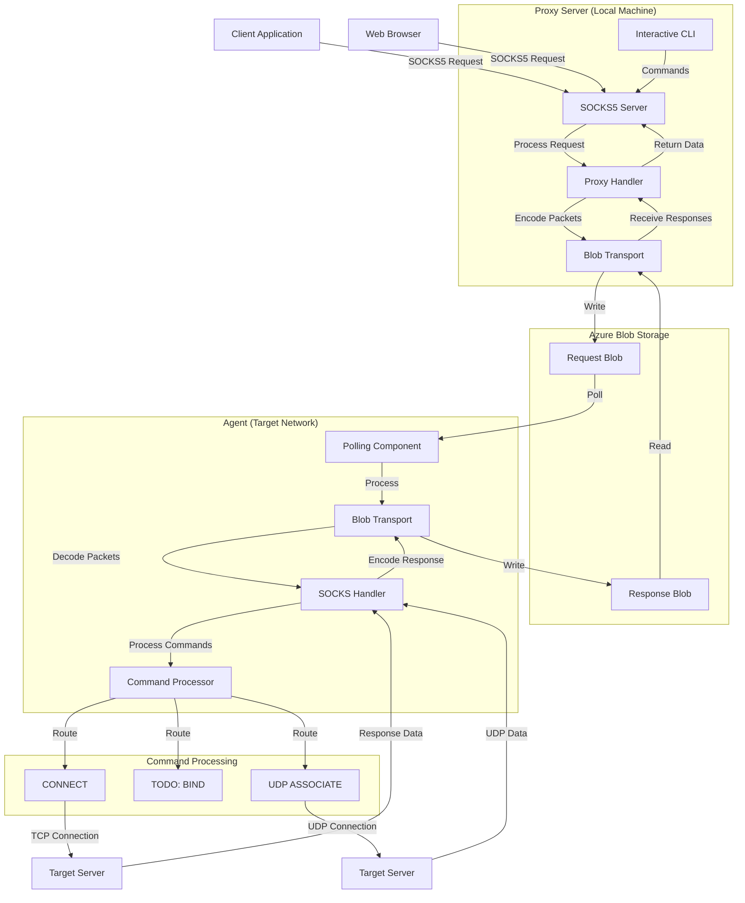
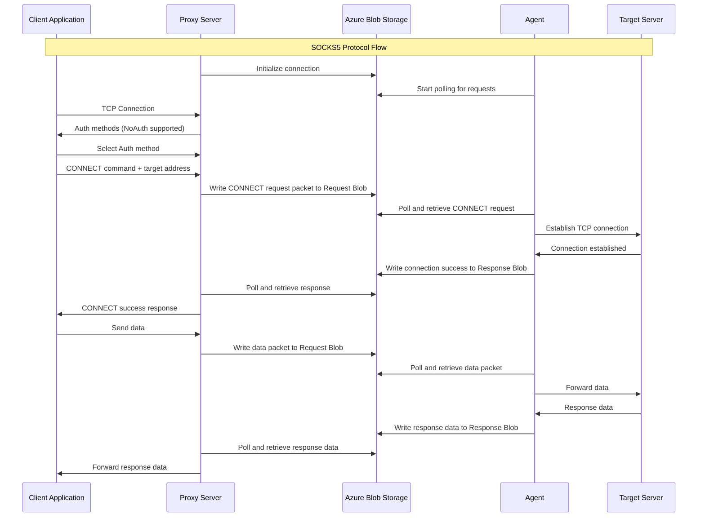

# ProxyBlob v2

🎉 New release ! _see [CHANGELOG](#changelog)_ 🎉

<p align="center">
  
</p>
<p align="center"><i>SOCKS proxy over Azure Storage service</i></p>

## Overview

ProxyBlob is a tool designed to create SOCKS proxy tunnels through Azure Storage services. This is particularly useful in environments where direct network connectivity is restricted but `*.core.windows.net` is accessible.

The system consists of two components:

1. **Proxy Server**: Runs on your local machine or a remote server and provides a SOCKS interface for your applications
2. **Agent**: Runs inside the target network and communicates with the proxy through Azure Storage services

## Features

- SOCKS5 protocol (CONNECT and UDP ASSOCIATE)
- Communication through Azure Storage services (thanks to [aznet](https://github.com/atsika/aznet)!)
- Interactive CLI with auto-completion
- Multiple agent management
- Local or remote proxy server

## Prerequisites

- Go 1.25 or higher
- An Azure Storage Account

### Storage Account

#### Azure

In order to use ProxyBlob, you will need an Azure Subscription to create an Azure Storage Account. Once you have a subscription, you can create a storage account in the Azure Portal or using the Azure CLI.

Here are the steps to create a storage account using the Azure Portal:

1. Go to [https://portal.azure.com](https://portal.azure.com)
2. Login with your Azure account
3. In the top Search bar, type "Storage accounts"
4. Click on "+ Create"
5. Fill in the required fields
6. Click on "Review + create"
7. Click on "Create"

Storage account settings:

- **Subscription**: Select your Azure subscription
- **Resource Group**: Create new Resource Group or select existing
- **Storage account name**: Choose a name for your storage account
- **Location**: Select a location near you
- **Performance**: Premium ⚠️ we will require low latency and high throughput
- **Premium account type**: Block blobs (high transaction rates)
- **Redundancy**: Locally-redundant Storage (LRS)

<p align="center">
  
</p>


Once the deployment is complete, you will see the newly created storage account in the list.

<p align="center">
  
</p>

Finally, click on "Security + networking" and then "Access keys" to get the storage account key.

<p align="center">
  
</p>

Here are the steps to create a storage account using the Azure CLI:

```bash
# Login to Azure
az login

# Create a resource group
az group create --name "proxyblob-resource-group" --location "Central US"

# Create a storage account
az storage account create --name "myproxyblob" --resource-group "proxyblob-resource-group" --location "Central US" --sku "Premium_LRS" --kind BlockBlobStorage

# Get the storage account key
az storage account keys list --account-name "myproxyblob" --output table
```

You should see displayed the storage account keys.

#### Azurite

If you want to test the tool, you can also use [Azurite](https://github.com/Azure/Azurite), a lightweight server clone of Azure Storage that can be run locally. To install Azurite, I recommend using either [Visual Studio Code extension](https://marketplace.visualstudio.com/items?itemName=Azurite.azurite) or [Docker](https://hub.docker.com/r/microsoft/azure-storage-azurite).

For the extension, installation is straightforward:

1. Go to the Extensions tab
2. Search for `Azurite.azurite`
3. Click "Install"

You should see down right of your editor 3 buttons like this:

```
[Azurite Table Service] [Azurie Queue Service] [Azurite Blob Service]
```

Press on the `[Azurite Blob Service]` and the service should be running.

For Docker, you will have to pull the image and run it:

```bash
docker pull mcr.microsoft.com/azure-storage/azurite
docker run -p 10000:10000 mcr.microsoft.com/azure-storage/azurite
```

The default storage account name is `devstoreaccount1` and the account key is `Eby8vdM02xNOcqFlqUwJPLlmEtlCDXJ1OUzFT50uSRZ6IFsuFq2UVErCz4I6tq/K1SZFPTOtr/KBHBeksoGMGw==`.

## Installation

```bash
# Clone the repository
git clone https://github.com/quarkslab/proxyblob
cd proxyblob

# Build both components
make
```

This will produce the following binaries:

- `proxy` - the proxy server running on your machine
- `agent` - the agent running on the target

## Configuration

Create a `config.json` file based on the [example](example_config.json) with your Azure Storage credentials:

```json
{
  "listeners": [
    {
      "name": "blob-listener",
      "driver": "azblob",
      "address": "https://proxyblob.blob.core.windows.net",
      "storage_account": "proxyblob",
      "storage_account_key": "your_account_key"
    },
    {
      "name": "queue-listener",
      "driver": "azqueue",
      "address": "http://127.0.0.1:10001",
      "storage_account": "devstoreaccount1",
      "storage_account_key": "Eby8vdM02xNOcqFlqUwJPLlmEtlCDXJ1OUzFT50uSRZ6IFsuFq2UVErCz4I6tq/K1SZFPTOtr/KBHBeksoGMGw=="
    }
  ]
}

```

You can configure multiple listeners and manage them in the proxy CLI.

## Usage

### Starting the Proxy Server

```bash
./proxy -c my-config.json # if omitted, config.json is used by default
```

This will start an interactive CLI with the following commands:

```
Commands:
  agent     manage agents
  clear     clear the screen
  exit      exit the shell
  help      use 'help [command]' for command help
  listener  manage listeners
  new       generate a new connection string for an agent
```

Once the proxy server is running, start a listener. The started listener automatically becomes the default for subsequent commands.

```
proxyblob » listener start blob-local-listener
21:23:25 INF Aznet listener started and set as default addr=http://127.0.0.1:10000 driver=azblob listener_id=blob-local-listener
```

Then you can generate a connection string by using the `new` command.

```
proxyblob » new
21:25:10 INF Connection string generated connection_string=YXpibG9ifGh0dHA6Ly8xMjcuMC4wLjE6MTAwMDAvZGV2c3RvcmVhY2NvdW50MT9oYW5kc2hha2U9YzJVOU1qQXlOaTB3TWkweE5sUXlNQ1V6UVRJMUpUTkJNVEJhSm5OcFp6MDRlR3ByVjJFeVNXdHhWWEJxUlU1cGJIVmtOVGhuWXpkNU5raDNXWEZNUmpZNVFrNDVaMUphT1ZNMEpUTkVKbk53UFdGamR5WnpjSEk5YUhSMGNITWxNa05vZEhSd0puTnlQV01tYzNROU1qQXlOaTB3TWkweE5WUXlNQ1V6UVRJd0pUTkJNVEJhSm5OMlBUSXdNalV0TVRFdE1EVSUzRCZ0b2tlbj1jMlU5TWpBeU5pMHdNaTB4TmxReU1DVXpRVEkxSlROQk1UQmFKbk5wWnowM2NXZ3dZVWgxV1dKTE1rcGlOVVYyVG5WTk1XdEpTMFJFVTFkVGNFWlllVXd5ZUV0dWRYaG9jVWc0SlRORUpuTndQWEpzSm5Od2NqMW9kSFJ3Y3lVeVEyaDBkSEFtYzNJOVl5WnpkRDB5TURJMkxUQXlMVEUxVkRJd0pUTkJNakFsTTBFeE1Gb21jM1k5TWpBeU5TMHhNUzB3TlElM0QlM0Q listener_id=blob-local-listener
```

Use the generated connection string with the agent (see below [Starting the Agent](#starting-the-agent)). If the agent connects successfully, you should see its identity (`user@host`) in the "Info" column when you list agents.

```
proxyblob » agent ls
╭──────────────────────────────────────┬─────────────────┬──────────────────────┬────────────┬─────────────────────┬───────────╮
│ AGENT ID                             │ INFO            │ LISTENER             │ PROXY PORT │ CONNECTED AT        │ LAST SEEN │
├──────────────────────────────────────┼─────────────────┼──────────────────────┼────────────┼─────────────────────┼───────────┤
│ 7b5af883-7cc7-45a4-8599-da906753005d │ atsika@mac.home │ blob-local-listener  │ 1080       │ 2026-02-15 21:50:04 │ 2m ago    │
╰──────────────────────────────────────┴─────────────────┴──────────────────────┴────────────┴─────────────────────┴───────────╯
```

Select the agent using `agent select <agent-id>` and start the proxy listener (by default it listens on localhost:1080) by using the `agent start` command.

```
proxyblob » agent select 7b5af883-7cc7-45a4-8599-da906753005d
22:10:40 INF Agent selected agent_id=7b5af883-7cc7-45a4-8599-da906753005d
7b5af883 » agent start
22:10:46 INF Proxy started agent_id=7b5af883-7cc7-45a4-8599-da906753005d port=1080
```

You can now use for example [proxychains](https://github.com/rofl0r/proxychains-ng) to tunnel the traffic through the SOCKS proxy.

```bash
proxychains xfreerdp /v:dc01.domain.local /u:Administrator
```

### Starting the Agent

In order to run, the agent requires a connection string that can be generated using the proxy. You can pass it as an argument or directly embed it at compile-time.

```bash
# Via argument
./agent -c <generated-connection-string>

# Build the agent with embedded connection string
make agent TOKEN=<generated-connection-string>
./agent
```

## Architecture

The communication flow works like this:

1. The agent periodically polls an Azure Blob container for encoded packets in a request blob
2. The proxy writes encoded packets to the Azure Blob container in a request blob
3. When the agent finds a packet, it processes it and writes the response back to a response blob
4. The proxy reads the response and maintains the SOCKS connection with client applications

The global flow is the following:



An example of a CONNECT operation is the following:



## Troubleshooting

**Why does my agent immediately stop running ?**

There might be several reasons why your agent stops immediately after you run it. Check its exit code:

```sh
# Bash
echo $?
```

```cmd
REM CMD
echo %ERRORLEVEL%
```

```pwsh
# PowerShell
echo $LastExitCode
```

Each exit code describes why the agent stopped running:

| Exit code | Reason                                      |
| --------- | ------------------------------------------- |
| 0         | No error                                    |
| 1         | The context has been canceled               |
| 2         | The connection string is missing            |
| 3         | The connection string is invalid or expired |

If you encounter issues:

1. Check Azure credentials and permissions
2. Verify connectivity to Azure Blob Storage
3. Check for any firewall rules blocking outbound connections
4. Ensure the agent is running and properly connected

## TODO

- BIND command (not implemented yet)
- Improve proxy speed even more

## CHANGELOG

**ProxyBlob v2 (aznet boosted) - 16/02/2026:**

- Complete architecture rewrite using aznet networking layer
- Multiple Azure Storage backends (Blob, Queue, Table Storage)
- Last seen timestamps for connected agents
- Enhanced connection management and lifecycle
- Better error handling and recovery mechanisms
- Improved polling efficiency with adaptive intervals
- Automatic connection cleanup and resource management
- Significantly higher throughput and lower latency
- Cost optimization through backend selection
- Multi-listener configuration support

**ProxyBlob public release - 29/04/2025:**

- SOCKS5 protocol (CONNECT and UDP ASSOCIATE)
- Reverse client-server architecture
- Azure Blob Storage communication
- Interactive CLI with auto-completion
- Multi-agent management
- Local or remote proxy server
- Container-based communication
- Connection string authentication
- Error handling
- Azurite support for local development

## License

[GNU GPLv3 License](LICENSE)

---

Made with ❤️ by [@_atsika](https://x.com/_atsika)
